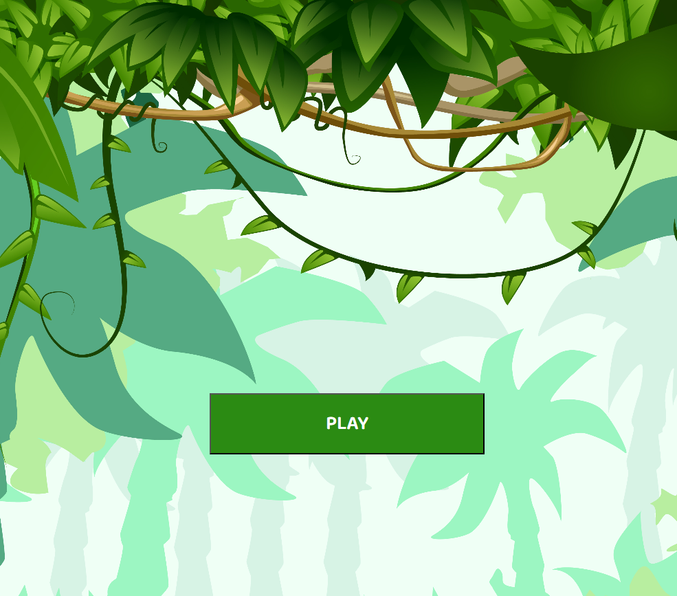
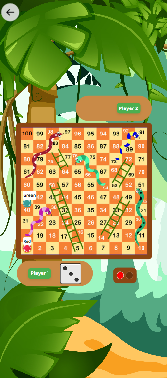

# Snake Ladder Game in Web (HTML5, CSS & JS)
A basic Snake and Ladder game is a board game where players move their tokens along a numbered grid based on the roll of a dice. When a player lands on a square with the base of a ladder, they climb up to a higher square. If they land on the head of a snake, they slide down to a lower square. The goal is to reach the final square first.

[Visit Linkedin](https://www.linkedin.com/in/piyush-garg-35066919a/)
[Live Demo](https://piyushgarg322230.github.io/Snake-Ladder-Game/)

